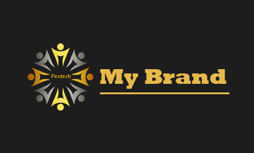

# mybrand-api

# Running it locally

- clone the repo
- install dependancies with `yarn` or `npm`
- create a .env file and add a PORT variable to your favorite port
- run the `dev-start` script using `npm run dev-start`

## Application Structure

- `server.js` - The entry point to our application. This file defines our express server and connects it to MongoDB using mongoose. It also requires the routes and models we'll be using in the application.
- `auth/` - This folder contains configuration for authentication as well as tokens
- `routes/` - This folder contains the route definitions for our API.
- `models/` - This folder contains the schema definitions for our Mongoose models.
- `controllers/` - This folder contains the definitions for each API endpoint route.

